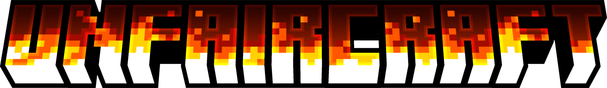
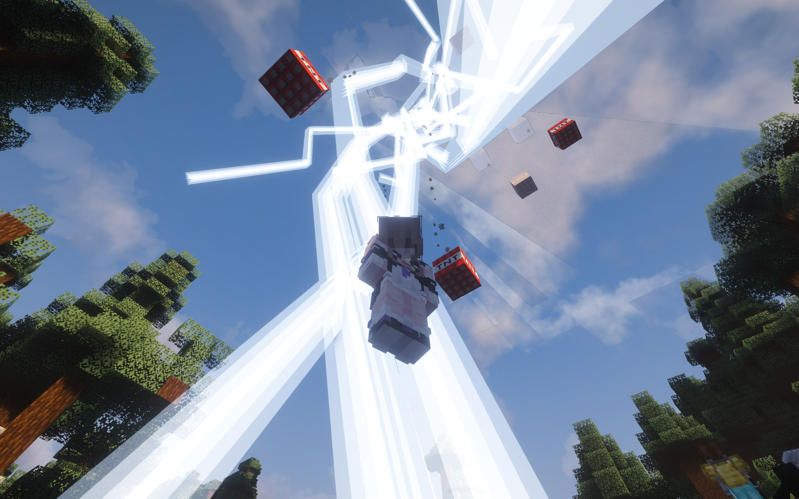
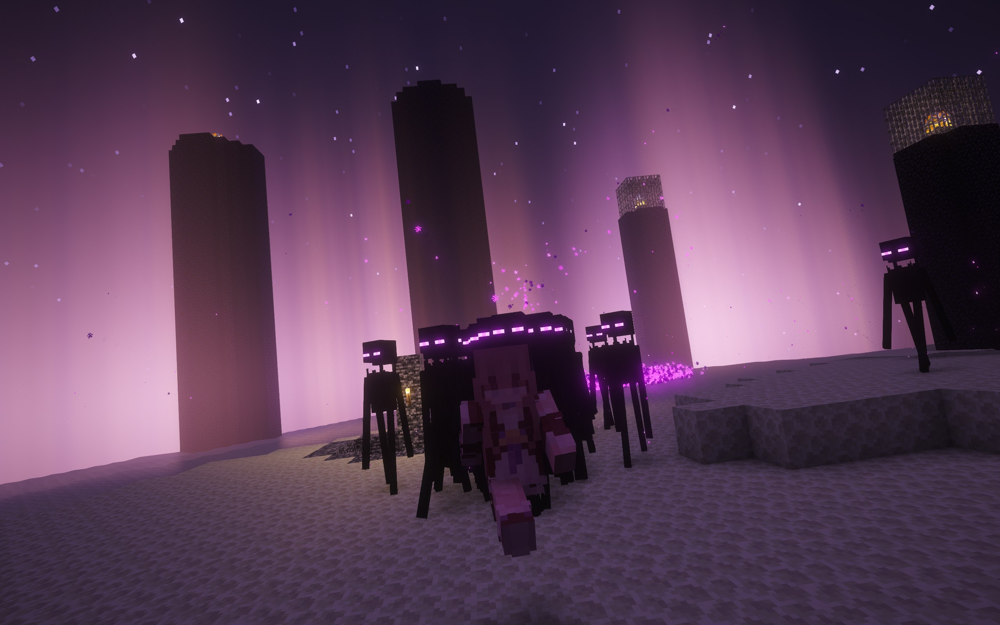
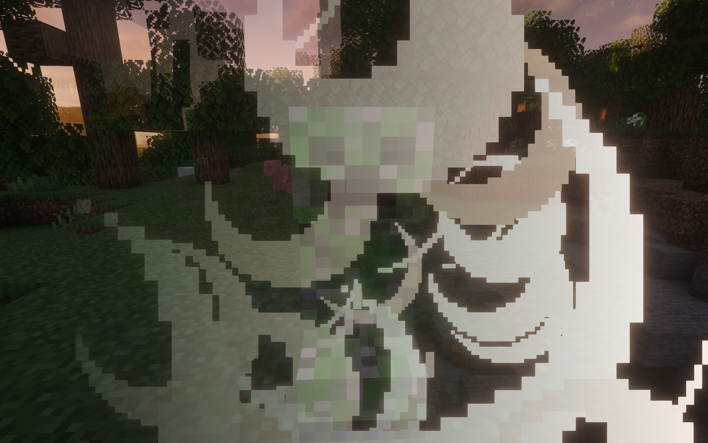
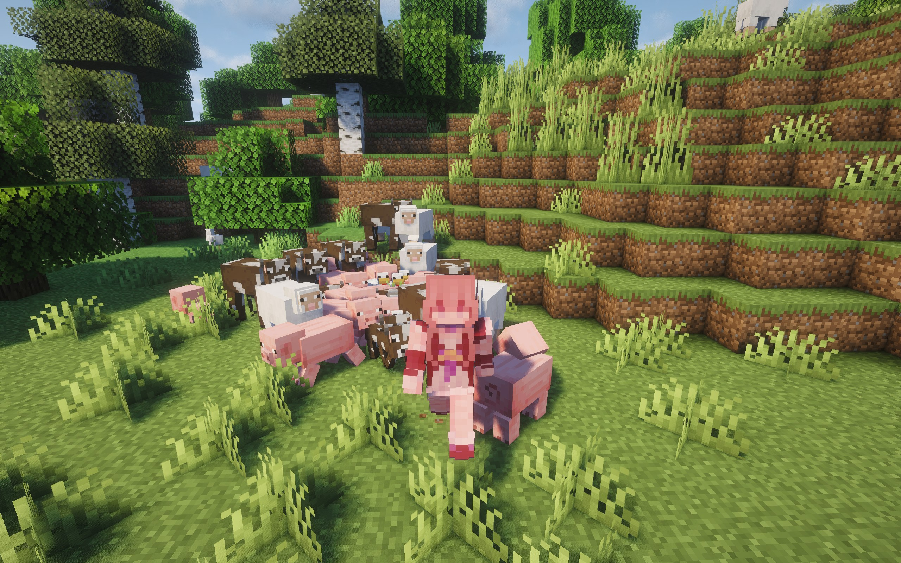
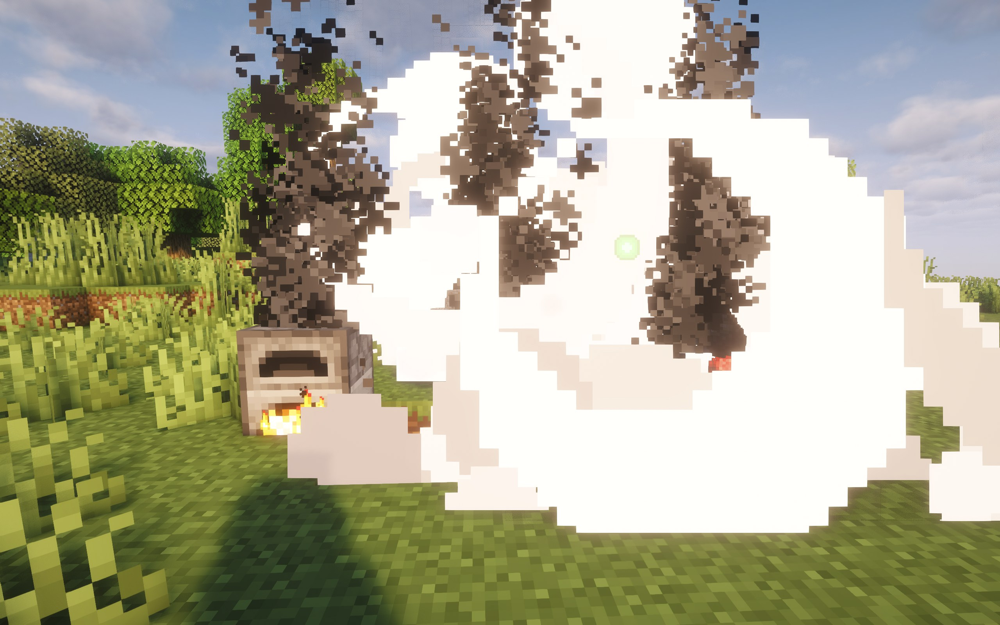

<p align="center"></p>

<h1 align="center">
    <a href="https://github.com/junyali/unfaircraft/actions/workflows/build.yml"></a>
    <a href="https://github.com/junyali/unfaircraft/releases/"></a>
    <a href="https://github.com/junyali/unfaircraft/blob/main/LICENSE"></a>
    <br>
    <a href="https://www.curseforge.com/minecraft/mc-mods/unfaircraft"></a>
    <a href="https://modrinth.com/mod/unfaircraft"></a>
    <a href="https://ko-fi.com/junyali"></a>
    <br><br>
</h1>

**Minecraft, but everything hates you.**

**Unfaircraft** is a Minecraft mod that makes the game... well, *unfair*.

This mod tweaks vanilla mechanics and behaviours in the most frustrating ways possible to make the game UNFAIR!

Nothing is safe. Not your tools, not your food, not your chests, not even the cows O.o

## What to look out for

### Unfair Mode

These "features" (if you can even call them one) are simple inconveniences. Deal with it.

- INTENTIONAL GAME DESIGNs sometimes apply to the overworld. I'd be careful about sleeping in your house!
- Animals and villagers have had enough of your antics! Prepare for some retaliation >:D
- Combat is botched. Bows might misfire or backfire. Swords might not even deal damage. Forgot to go to the gym?
- Your legs are on steroids.
- Spelunking adventures may take a few more hours (or IRL days! Depends on your luck).
- Chests are hungry sometimes. Wouldn't store valuables in them if I were you.
- Anvils are now run by EA. Expect microtransactions!
- Trees and crops are lazy. No motivation to grow.
- Minecarts are now sentient and have developed a fear of rails. They prefer scenic detours.
- and more! See if you notice them :P

### Nightmare Mode

For those who need MORE FRUSTRATION to fuel the ANGER!!! Every tick is now a lottery.

- Surprise! Here's some undead roommates. Hope you weren't attached to that base.
- It's raining TNT! From outta the sky. TNT. No need to ask why.
- Zeus called. He wants to play with you.

*Nightmare Mode is disabled by default.*

## Preview

| Image                                                                            | Feature                       |
|----------------------------------------------------------------------------------|-------------------------------|
|  | TNT Rain / Thunder Strike     |
|                 | Endermen swarm aggressively   |
|                    | Creepers are deadlier         |
|            | Animals attack back           |
|              | Furnaces overheat and explode |

## How to Run / Build

### Requirements

**Fabric**: This mod was built on Fabric Loader version 0.19.2 for 1.21.1

**Fabric API**: This mod uses Fabric API (tested on version 0.116.11+1.21.1) and is a required dependency

**owo-lib**: This mod uses owo-lib version 0.12.15.4+1.21 and is a required dependency to provide the config library for Unfaircraft

### Running

1. Download the latest release [here](https://github.com/junyali/unfaircraft/releases) or from your favourite mod distribution platform (CurseForge and Modrinth).
2. Drop it in your `mods` directory
3. Boot up Minecraft
4. Immediately regret your decisions

You may configure how the mod modifies vanilla behaviour in `unfaircraft.json5` under the `config` directory (or alternatively use a mod like [Mod Menu](https://modrinth.com/mod/modmenu)).
- Disable specific tortures (but where's the fun in that?)
- Adjust event probabilities
- Enable Nightmare Mode

### Building

This mod was developed on IntelliJ IDEA Ultimate, though may work with over Java IDEs that support the Gradle Build Tool.
Importing from `build.gradle`, run:

```console
$ ./gradlew
```

Then to launch the client configuration, run:

```console
$ ./gradlew runClient
```

Be sure to sync all gradle projects and refresh dependencies if you encounter issues related to Gradle.

*"It's not a bug, it's psychological warfare!"*

