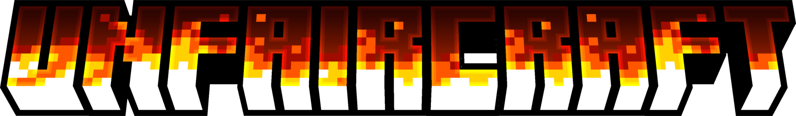

<p align="center"></p>

<h1 align="center">
    <a href="https://github.com/junyali/unfaircraft/actions/workflows/build.yml"></a>
    <a href="https://github.com/junyali/unfaircraft/releases/"></a>
    <a href="https://github.com/junyali/unfaircraft/blob/main/LICENSE"></a>
    <a href="https://ko-fi.com/junyali"></a>
    <br><br>
</h1>

**Unfaircraft** is a Minecraft mod that makes the game... well, *unfair*.
This mod introduces subtle (and not-so-subtle) modified vanilla behaviours that makes the game UNFAIR!
You shall feel frustration, pain, and suffering - but the challenge is on!

## What to look out for

### Unfair Mode

These "features" (if you can even call them one) are simple inconveniences. Deal with it.

- INTENTIONAL GAME DESIGNs sometimes apply to the overworld. I'd be careful about sleeping in your house!
- Combat is botched. Bows might misfire or backfire. Swords might not even deal damage. Forgot to go to the gym?
- Your legs are on steroids.
- Spelunking adventures may take a few more hours (or IRL days! Depends on your luck).
- Chests are hungry sometimes. Wouldn't store valuables in them if I were you.
- Anvils are now run by EA. Expect microtransactions!
- Trees and crops are lazy. No motivation to grow.
- Minecarts are now sentient and have developed a fear of rails. They prefer scenic detours.
- and more! See if you notice them :P

### Nightmare Mode

For those who need MORE FRUSTRATION to fuel the ANGER!!! Every tick is now a lottery.

- Surprise! Here's some undead roommates. Hope you weren't attached to that base.
- It's raining TNT! From outta the sky. TNT. No need to ask why.
- Zeus called. He wants to play with you.

There's more but my 2am sleep deprived brain cannot be bothered to write more :D

*Nightmare Mode is disabled by default.*

## Preview


## How to Run / Build

### Requirements

**NeoForge**: This mod was built on NeoForge version 21.1.173 for 1.21.1

### Running

1. Download the latest release [here](https://github.com/junyali/unfaircraft/releases).
2. Drop it in your `mods` directory
3. Boot up Minecraft
4. Immediately regret your decisions

You may configure how the mod modifies vanilla behaviour in `unfaircraft.toml` under the `config` directory.
- Disable specific tortures (but where's the fun in that?)
- Adjust event probabilities
- Enable Nightmare Mode

### Building

This mod was developed on Intellij IDEA Ultimate, though may work with over Java IDEs that support the Gradle Build Tool.
Importing from `build.gradle`, run:

```console
$ ./gradlew
```

Then to launch the client configuration, run:

```console
$ ./gradlew runClient
```

Be sure to sync all gradle projects and refresh dependencies if you encounter issues related to Gradle.

*"It's not a bug, it's psychological warfare!"*

